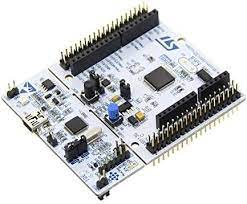

# TP1 Snake (Matriz de leds)

## Nicolás Ferragamo
## nferragamo@abc.gob.ar

# Introducción
El proyecto consiste en la generación y testeo de las funciones básicas qee permitan en un futuro la implementación de un juego de la serpiente en una matriz de leds.

Para ello en este trabajo se desarrollaron las funciones necesarias para el maneo de una matriz de leds de 7*5, de las cuales se dispone de 8 módulos, el manejo de botones, manejo de entradas analógicas, uso de temporizadores (con interrupciones) y manejo de comunicación serial.

Como excusa para para el logro de ese proyecto se planteó en este trabajo implementar un programa capaz de mostrar un mensaje en la matriz de leds, el cual se puede desplazar de derecha a izquierda y puede ser actualizado utilizando la interfaz serial.

En segundo lugar se implemento la lectura de un potenciómetro, que auspicia de sensor de temperatura y se muestra su valor tanto en la matriz de leds como en la PC. 

La temperatura se puede visualizar tanto en °C como en °F.

# Desarrollo
## Circuito
Se realizo el proyecto utilizando una placa de desarrollo de la familia STM32F4, en particular la placa de desarrollo STM32F401RE. La misma cuenta con un microcontrolador STM32F401RET6, el cual posee un núcleo ARM Cortex-M4 a 84 MHz. 



Un módulo de matriz de leds de 7*5, el cual cuenta con 5 de registro de desplazamiento [74HC595](documnets/Cdocuments/CD74HC595.PDF) para las 40 columnas y un 6 registro para controlar las filas, que a su vez tienen un driver [ULN2003](documents/documents/ULN2003A.PDF). Las entradas de la placa tiene resistencias de pull-up, el output_enable es activo bajo y el clear esta desactivado por hardware. Se utilizó un logic level shifter ya que la placa de desarrollo trabaja a 3,3V y la matriz a 5V. (limitación del ULN2003)


Se utilizo un potenciómetro para simular un sensor de temperatura, el cual se conecto a una entrada analógica de la placa de desarrollo. El mismo esta alimentado a 3,3V.

A su vez se utilizaron 3 botones para seleccionar cada modo de funcionamiento.

El diagrama en bloque es el siguiente:


### Asignaciones de pines
#### Salidas digitales
```cpp
DigitalOut RCK(D2);  //!< Latch Clock o STC
DigitalOut SCK(D3);  //!< Serial Clock o SHC
DigitalOut SI(D4);   //!< Serial Input o DS
DigitalOut OE_L(D5); //!< Output Enable, es activo bajo
``` 
#### Entradas digitales
```cpp
DigitalIn msgButton(D6);                    //!< botón para mostrar un mensaje en la matriz
DigitalIn celciusButton(D7);                //!< botón para mostrar la temperatura en grados celcius
DigitalIn fahrenheitButton(D8);             //!< botón para mostrar la temperatura en grados fahrenheit
``` 

#### Entradas analógicas
```cpp
AnalogIn tempSensor(A0); //!< Sensor de temperatura
```

#### Comunicación serial
```cpp
Serial pc(USBTX, USBRX); //!< Comunicación serial con la PC
```

## Funcionamiento
El programa se divide en 3 modos de funcionamiento, los cuales se seleccionan mediante los botones.
El primer botón selecciona el modo texto, el cual permite mostrar un mensaje de hasta 32 caracteres en la matriz de leds. Al iniciar ese módulo se muestra un mensaje por defecto y se envía un mensaje a la PC pidiendo que escriba el mensaje a mostrar. El mensaje sera actualizado luego de presionar el caractér \r\n.
Importante, la velocidad de comunicación debe ser de 115200 baudios.

El mensaje se desplaza a la derecha con un intervalo de 100ms entre cada columna. Se visualiza de manera circular, es decir, cuando se llega al final del mensaje se vuelve a mostrar el principio.

El segundo modo de funcionamiento es el modo temperatura en grados celcius. En este modo se muestra la temperatura en la matriz de leds y en la PC. La temperatura se actualiza cada 1s. Durante el primer segundo se muestra la temperatura errónea por defecto, esperando a que se estabilice el sensor.

Se realizan 10 mediciones a intervalos de 100ms y se promedian para obtener la temperatura. Siempre se muestra la última temperatura estable.

El tercer modo de funcionamiento es el modo temperatura en grados fahrenheit. Funciona de la misma manera que el modo anterior, pero se muestra la temperatura en grados fahrenheit.

## Código
Se desarrollaron diferentes librerías para la implementación de este programa, no se entrara en detalle ya que las mismas esta debidamente documentadas en los archivos .h y .cpp.

- Librería para el manejo de la matriz de leds.
- Librería para el manejo de delay. (no bloqueantes)
- Librería para el maneo de las entradas analógicas.
- Manejo de los botones.
- Maquina de estado para el manejo de los modos de funcionamiento.

Se realizo código modular, aunque no cumple con los criterios de la presentación mostrada, para ello necesito mas tiempo para refactorizar el código.

Se documento el código utilizando doxygen, el cual se puede generar la documentación con el comando `doxygen Doxyfile`.


## Video
El siguiente video muestra el funcionamiento del programa. (me di cuenta en este momento que tine un error de formato el video, pero no llego con el tiempo a volverlo a gravar. Disculpas por eso.)

<div align="left">
      <a href="https://youtu.be/3OxxepSsEAg">
         
      </a>
</div>